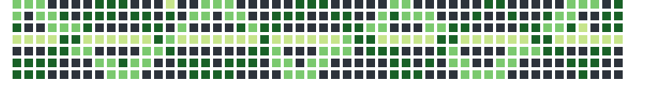

<h1 align="center"><b>Hi , I'm Eduardo </b></h1>

<picture decoding="async" loading="lazy">
          
</picture>

 

## <picture></picture> **About me**

- <b>Coming!!</b>

 

## <b> Skills</b>
 

### **Front-End Development**:

   
   
   
   
   
   

 

### **Back-End Development**:

   
   
   

 

### Most Used Tools 

## <b> Github Statistics </b>

 

# 

 

Thanks for visiting !!

 

<picture>
          
</picture>

 

# 

 

  
  <a href = "https://www.linkedin.com/in/eduardo-goncalves-souza/">https://img.shields.io/badge/LinkedIn-0A66C2?style=for-the-badge&logo=linkedin&logoColor=white</a>
